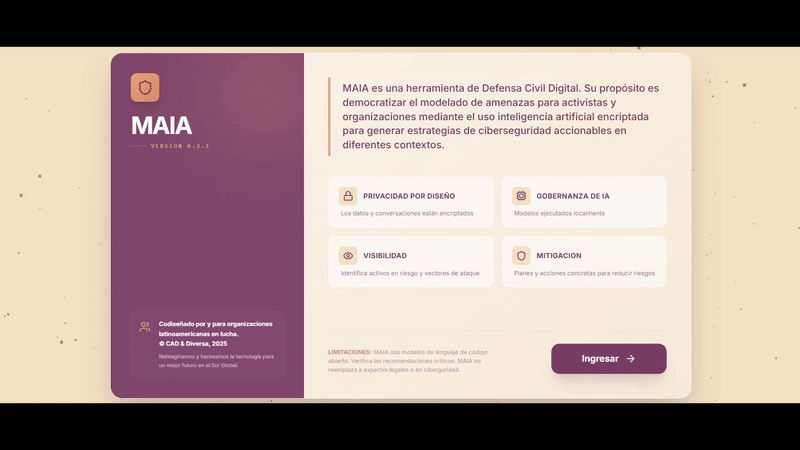

# MAIA : Modelado de Amenazas con Inteligencia Artificial

Las organizaciones civiles en América Latina y el Caribe enfrentan un contexto de creciente represión digital caracterizado por el uso de tecnologías para vigilancia, censura, control y persecución. Esta situación, junto con la falta de recursos técnicos y económicos, expone a las organizaciones sociales a graves riesgos que amenazan su trabajo y la seguridad de sus equipos y beneficiarios.

Aunque el modelado de amenazas es una metodología efectiva para identificar y clasificar riesgos digitales, su complejidad dificulta su aplicación en organizaciones con recursos limitados. Por ello, desarrollamos **MAIA** (*Modelado de Amenazas con Inteligencia Artificial*), una herramienta que integra un modelo de lenguaje basado en Inteligencia Artificial para simplificar hasta un **95% el proceso manual** de clasificación de amenazas.

MAIA incluye un **dashboard interactivo** para visualizar amenazas y un **chat asistido por IA** que facilita la toma de decisiones de seguridad de forma rápida y efectiva.



---
## Metodología

MAIA está fundamentado en metodologías reconocidas de modelado de amenazas, adaptadas al contexto de organizaciones de la sociedad civil en América Latina:

- **STRIDE**: Para categorización de amenazas
- **JURIST**: Método adaptado para análisis de riesgo

---

## Características Principales

### Asistente IA
MAIA cuenta con cuatro agentes de inteligencia artificial, cada uno especializado en una fase específica del modelado de amenazas:

- **Registro**: Identifica y cataloga activos críticos y adversarios potenciales mediante entrevistas guiadas
- **Modelado de Amenazas**: Analiza vulnerabilidades cruzando activos con vectores de ataque
- **Mitigación**: Crea planes y estrategias defensivas y planes de acción concretos
- **Consulta General**: Proporciona orientación experta sobre metodologías y mejores prácticas

### Dashboard Interactivo
Panel de control completo que visualiza:
- Inventario de activos críticos
- Perfiles de adversarios
- Matriz de riesgos en tiempo real
- Métricas de seguridad y KPIs
- Planes de mitigación activos

### Base de Conocimiento
Sistema integrado de documentación que incluye:
- Fundamentos teóricos sobre modelado de amenazas
- Ejemplos prácticos y casos de uso
- Método JURIST adaptado
- Espacio para documentación personalizada

### Sistema de Notificaciones Inteligentes
Alertas proactivas que guían al usuario a través del proceso de modelado, sugiriendo próximos pasos y acciones recomendadas según el contexto.

---

## Arquitectura Técnica

### Stack Tecnológico
- **Frontend**: React + TypeScript
- **UI Framework**: Tailwind CSS con sistema de diseño personalizado
- **IA**: Gemini API con arquitectura multi-agente - esto será modificado por el Small Language Models locales en una segunda etap.
- **Gestión de Estado**: React Context API
- **Persistencia**: LocalStorage con serialización JSON
- **Markdown**: Marked.js para renderizado de documentación

### Componentes Principales

```
v_0.3.2/
├── components/          # Componentes UI modulares
│   ├── Dashboard.tsx    # Panel de control principal
│   ├── ChatInterface.tsx    # Interfaz conversacional con IA
│   ├── KnowledgeBase.tsx    # Explorador de documentación
│   ├── TrackerPanel.tsx     # Panel de contexto en tiempo real
│   └── NotificationSystem.tsx   # Sistema de alertas
├── services/           # Lógica de negocio
│   ├── AIService.ts    # Integraciones AI
│   └── prompts.ts      # Prompts especializados por agente
├── data/              # Datos y estructuras
│   ├── demoData.ts    # Datos de demostración
│   └── knowledgeData.ts   # Base de conocimiento
└── types.ts           # Definiciones TypeScript
```

### Flujo de Trabajo

1. **Autenticación**: Sistema multi-usuario con perfiles persistentes
2. **Registro de Activos**: Identificación de recursos críticos a proteger
3. **Perfilado de Adversarios**: Análisis de amenazas potenciales
4. **Modelado de Amenazas**: Cruce automatizado usando IA para identificar riesgos
5. **Generación de Planes**: Creación de estrategias de mitigación personalizadas
6. **Seguimiento**: Monitoreo del estado de implementación

---

## Equipo

**Sara Zambrano**
Directora Ejecutiva - Centro de Autonomía Digital (CAD)
📧 sara@autonomia.digital

**Diana Mosquera**
Representante - Consorcio Fundación Scientia - Diversa
📧 diana@diversa.studio

**Ubicación**: Quito, Ecuador

---

## Contribuciones

Este proyecto busca fortalecer la seguridad digital de organizaciones sociales en América Latina y el Caribe. Las contribuciones, sugerencias y mejoras son bienvenidas.

---

## Contacto

Para más información sobre MAIA, colaboraciones o soporte:

- Centro de Autonomía Digital: [https://autonomia.digital](https://autonomia.digital)
- Diversa: [https://diversa.studio](https://diversa.studio)

---

**MAIA v0.3.2** - Protegiendo a quienes protegen
